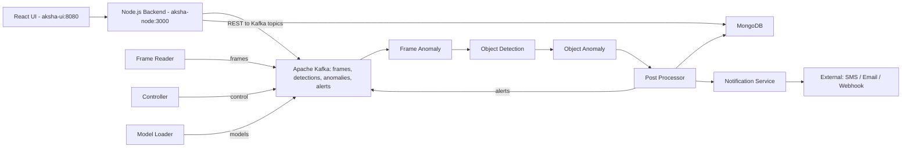
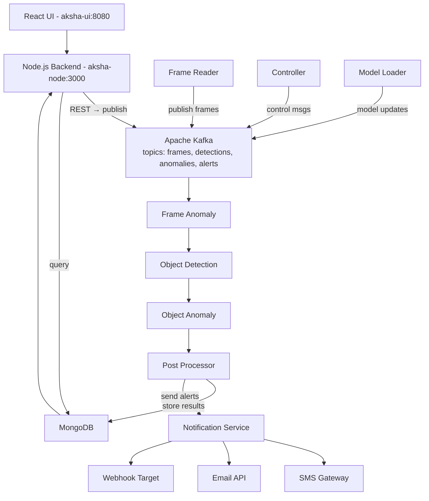

# 🚀 Aksha v2.1 — PoC Deployment on Docker Swarm + Apache Kafka

This document describes the **complete Proof-of-Concept (PoC)** deployment of **Aksha v2.1**, an AI-based surveillance and anomaly detection system. It uses **Docker Swarm** for orchestration and **Apache Kafka (Bitnami)** for real-time message streaming. The guide covers architecture, flow diagrams, setup steps, Dockerfiles, Swarm stack, and GitHub references.

---

## 1️⃣ Overview

Aksha v2.1 is designed to process live camera feeds for anomaly detection, using modular microservices that communicate through Kafka topics. MongoDB serves as the persistent data store for results and models.

This setup replicates the Kubernetes-based Aksha architecture in Docker Swarm, making it portable and easier to deploy in smaller or experimental environments.

---

## 2️⃣ High-Level Architecture — (Swarm + Kafka)

| Layer                | Service                  | Description                                   |
| -------------------- | ------------------------ | --------------------------------------------- |
| **UI Layer**         | React Frontend           | User interface dashboard                      |
|                      | Node.js Backend          | REST API and gateway for UI requests          |
| **Processing Layer** | frame-reader             | Reads camera feeds, publishes frames to Kafka |
|                      | controller               | Orchestrates metadata, manages state          |
|                      | anomaly-model-loader     | Loads and updates anomaly models              |
|                      | frame_anomaly            | Detects anomalies per frame                   |
|                      | object_detection_service | Detects objects using trained models          |
|                      | object_anomaly           | Object-level anomaly classification           |
|                      | post-processor           | Aggregates results, saves to MongoDB          |
|                      | notification             | Sends alert notifications                     |
| **Data Layer**       | Apache Kafka             | Manages message topics for real-time streams  |
|                      | MongoDB                  | Stores processed data, models, and alerts     |
| **Infra Layer**      | Docker Swarm             | Container orchestration                       |
|                      | Overlay Network          | Enables inter-service communication           |

---

## 3️⃣ Visual Architecture Diagram (Data Flow)

```
[ React UI (aksha-ui:8080) ]
         ↓
   [ Node.js Backend (aksha-node:3000) ]
         ↓ REST → Kafka Topics
 ┌──────────────────────────┐
 │       Apache Kafka       │
 │ Topics: frames, detections, anomalies, alerts │
 └──────────────────────────┘
         ↑                 ↑
         │                 │
 [ Frame Reader ] →→→ [ Controller ] →→ [ Model Loader ]
         ↓                     ↓
 [ Frame Anomaly ] → [ Object Detection ] → [ Object Anomaly ]
         ↓                                         ↓
   [ Post Processor ] →→→ [ MongoDB ] →→ [ Notification ]
```

🔸 Kafka acts as the central data highway.
🔸 MongoDB stores results, models, and alert logs.
🔸 Node backend queries MongoDB for the UI.
🔸 Each Python microservice is stateless and scalable via Swarm.

---
## 2. High-level architecture & flows




## 4️⃣ Environment Setup

### ✅ Prerequisites

| Component     | Version                      | Description             |
| ------------- | ---------------------------- | ----------------------- |
| Docker Engine | ≥ 24.x                       | Installed on all nodes  |
| Docker Swarm  | Active                       | Run `docker swarm init` |
| Ports Open    | 2377, 7946, 4789, 8080, 3000 | Swarm + UI + API        |
| OS            | Ubuntu 20.04+ / Debian       | Tested base             |

### 🧭 Swarm Initialization

```bash
# On manager node
docker swarm init --advertise-addr <MANAGER_IP>

# On worker nodes
docker swarm join --token <TOKEN> <MANAGER_IP>:2377
```

---

## 5️⃣ Dockerfile Templates

### 🐍 A. Python Microservices

```dockerfile
FROM python:3.10-slim
WORKDIR /app
COPY requirements.txt .
RUN apt-get update && apt-get install -y --no-install-recommends build-essential ffmpeg libsm6 libxext6 \
    && pip install --no-cache-dir -r requirements.txt \
    && rm -rf /var/lib/apt/lists/*
COPY . .
EXPOSE 8080
CMD ["python", "main.py"]
```

### 🟩 B. Node.js Backend

```dockerfile
FROM node:18-alpine
WORKDIR /usr/src/app
COPY package*.json ./
RUN npm ci --only=production
COPY . .
EXPOSE 3000
CMD ["node", "dist/index.js"]
```

### ⚛️ C. React Frontend

```dockerfile
FROM node:18-alpine as build
WORKDIR /app
COPY package*.json ./
RUN npm ci
COPY . .
RUN npm run build

FROM nginx:alpine
COPY --from=build /app/build /usr/share/nginx/html
EXPOSE 80
CMD ["nginx", "-g", "daemon off;"]
```

---

## 6️⃣ Swarm Stack File — `aksha-swarm-stack.yml`

```yaml
version: '3.8'

networks:
  aksha-net:
    driver: overlay

volumes:
  mongo-data:
  kafka-data:
  zookeeper-data:

services:

  zookeeper:
    image: bitnami/zookeeper:3.8
    environment:
      - ALLOW_ANONYMOUS_LOGIN=yes
    networks:
      - aksha-net
    volumes:
      - zookeeper-data:/bitnami

  kafka:
    image: bitnami/kafka:3.5
    environment:
      - KAFKA_CFG_ZOOKEEPER_CONNECT=zookeeper:2181
      - KAFKA_CFG_LISTENERS=PLAINTEXT://:9092
      - KAFKA_CFG_ADVERTISED_LISTENERS=PLAINTEXT://kafka:9092
      - ALLOW_PLAINTEXT_LISTENER=yes
    networks:
      - aksha-net
    depends_on:
      - zookeeper
    volumes:
      - kafka-data:/bitnami

  mongo:
    image: mongo:6
    networks:
      - aksha-net
    volumes:
      - mongo-data:/data/db

  node_backend:
    image: dockerhubalgo/aksha_node_backend_refactor:08102025
    networks:
      - aksha-net
    ports:
      - "3000:3000"
    environment:
      - KAFKA_BROKERS=kafka:9092
      - MONGO_URL=mongodb://mongo:27017/aksha

  aksha-ui:
    image: dockerhubalgo/aksha_react_frontend_refactor:08102025
    networks:
      - aksha-net
    ports:
      - "8080:80"

  frame-reader:
    image: <yourhub>/aksha_frame_reader:08102025
    environment:
      - KAFKA_BROKERS=kafka:9092
      - TOPIC_FRAMES=frames
    networks:
      - aksha-net

  controller:
    image: <yourhub>/aksha_controller:08102025
    environment:
      - KAFKA_BROKERS=kafka:9092
      - MONGO_URL=mongodb://mongo:27017/aksha
    networks:
      - aksha-net

  anomaly-model-loader:
    image: <yourhub>/aksha_anomaly_model_loader:08102025
    environment:
      - MONGO_URL=mongodb://mongo:27017/aksha
    networks:
      - aksha-net

  frame-anomaly:
    image: <yourhub>/aksha_frame_anomaly:08102025
    environment:
      - KAFKA_BROKERS=kafka:9092
    networks:
      - aksha-net

  object-detection:
    image: <yourhub>/aksha_object_detection:08102025
    networks:
      - aksha-net
    environment:
      - KAFKA_BROKERS=kafka:9092

  object-anomaly:
    image: <yourhub>/aksha_object_anomaly:08102025
    environment:
      - KAFKA_BROKERS=kafka:9092
    networks:
      - aksha-net

  post-processor:
    image: <yourhub>/aksha_post_processor:08102025
    environment:
      - KAFKA_BROKERS=kafka:9092
      - MONGO_URL=mongodb://mongo:27017/aksha
    networks:
      - aksha-net

  notification:
    image: <yourhub>/aksha_notification:08102025
    environment:
      - KAFKA_BROKERS=kafka:9092
    networks:
      - aksha-net
```

---

## 7️⃣ Deployment Steps

```bash
# Initialize swarm
docker swarm init

# Build and push service images
docker build -t <hub>/aksha_frame_reader:08102025 ./frame-reader
docker push <hub>/aksha_frame_reader:08102025

# Deploy stack
docker stack deploy -c aksha-swarm-stack.yml aksha

# Verify
watch docker stack services aksha
```

---

## 8️⃣ Kafka Topics Setup

```bash
docker exec -it $(docker ps --filter ancestor=bitnami/kafka -q | head -1) bash

kafka-topics.sh --create --topic frames --bootstrap-server kafka:9092
kafka-topics.sh --create --topic detections --bootstrap-server kafka:9092
kafka-topics.sh --create --topic frame_anomaly --bootstrap-server kafka:9092
kafka-topics.sh --create --topic alerts --bootstrap-server kafka:9092
```

---

## 9️⃣ Scaling & Health Checks

```bash
# Scale any service
docker service scale aksha_frame-reader=4

# View logs
docker service logs -f aksha_controller
```

---

## 🔟 Troubleshooting

| Issue                    | Solution                                      |
| ------------------------ | --------------------------------------------- |
| Kafka connection refused | Check logs: `docker service logs aksha_kafka` |
| Mongo connection timeout | Verify MongoDB is healthy                     |
| Topic not found          | Manually create missing topics                |
| UI blank                 | Confirm Node backend `3000` is reachable      |

---

## 1️⃣1️⃣ GitHub Source References

| Service                  | Repository                                                                                                                                                                             |
| ------------------------ | -------------------------------------------------------------------------------------------------------------------------------------------------------------------------------------- |
| anomaly-model-loader     | [https://github.com/algoanalytics-pvt/AkshaK8s-V3/tree/master/src/anomaly-model-loader](https://github.com/algoanalytics-pvt/AkshaK8s-V3/tree/master/src/anomaly-model-loader)         |
| controller               | [https://github.com/algoanalytics-pvt/AkshaK8s-V3/tree/master/src/controller](https://github.com/algoanalytics-pvt/AkshaK8s-V3/tree/master/src/controller)                             |
| frame-reader             | [https://github.com/algoanalytics-pvt/AkshaK8s-V3/tree/master/src/frame-reader](https://github.com/algoanalytics-pvt/AkshaK8s-V3/tree/master/src/frame-reader)                         |
| frame_anomaly            | [https://github.com/algoanalytics-pvt/AkshaK8s-V3/tree/master/src/frame_anomaly](https://github.com/algoanalytics-pvt/AkshaK8s-V3/tree/master/src/frame_anomaly)                       |
| notification             | [https://github.com/algoanalytics-pvt/AkshaK8s-V3/tree/master/src/notification](https://github.com/algoanalytics-pvt/AkshaK8s-V3/tree/master/src/notification)                         |
| object_anomaly           | [https://github.com/algoanalytics-pvt/AkshaK8s-V3/tree/master/src/object_anomaly](https://github.com/algoanalytics-pvt/AkshaK8s-V3/tree/master/src/object_anomaly)                     |
| object_detection_service | [https://github.com/algoanalytics-pvt/AkshaK8s-V3/tree/master/src/object_detection_service](https://github.com/algoanalytics-pvt/AkshaK8s-V3/tree/master/src/object_detection_service) |
| post-processor           | [https://github.com/algoanalytics-pvt/AkshaK8s-V3/tree/master/src/post-processor](https://github.com/algoanalytics-pvt/AkshaK8s-V3/tree/master/src/post-processor)                     |

---
# 🚀 Addendum — Dockerfiles for Python microservices + Step-by-step engineer test instructions

Nice — I added **production-ready Dockerfiles** for the Python microservices, a **local Docker Compose** (fast test harness), and a **detailed step-by-step checklist** an engineer can follow to build, run and verify the Aksha PoC you posted. Paste these into your repo alongside the service code (one folder per microservice).

> I assume each Python microservice has a `requirements.txt`, a `main.py` (or `app.py`) entrypoint and accepts environment variables like `KAFKA_BROKERS`, `TOPIC_*`, and `MONGO_URL`. If filenames differ, adapt the `CMD` lines.

---

# Dockerfile templates — Python microservices (copy one per service)

> Save each of the below as `Dockerfile` inside the microservice directory (e.g. `frame-reader/Dockerfile`, `frame-anomaly/Dockerfile`, etc.)

### 1) Minimal, slim, production-friendly (with non-root user, healthcheck)

```dockerfile
# Dockerfile (python microservice - production)
FROM python:3.10-slim

# create non-root user
ENV APP_HOME=/app \
    PYTHONDONTWRITEBYTECODE=1 \
    PYTHONUNBUFFERED=1

RUN apt-get update && apt-get install -y --no-install-recommends \
        build-essential \
        ffmpeg \
        libsm6 libxext6 \
    && rm -rf /var/lib/apt/lists/*

WORKDIR ${APP_HOME}
COPY requirements.txt ./
RUN pip install --no-cache-dir -r requirements.txt

# copy app
COPY . ${APP_HOME}
# ensure logs and runtime files are writable
RUN addgroup --system aksha && adduser --system --ingroup aksha aksha \
 && chown -R aksha:aksha ${APP_HOME}
USER aksha

EXPOSE 8080

HEALTHCHECK --interval=30s --timeout=5s --start-period=30s --retries=3 \
  CMD python -c "import os,sys,requests; \
    sys.exit(0) if os.getenv('HEALTH_ENDPOINT','')=='' or requests.get(os.getenv('HEALTH_ENDPOINT','http://localhost:8080/health')).status_code==200 else sys.exit(1)"

CMD ["python", "main.py"]
```

---

### 2) If service uses heavy libs (OpenCV, torch) — small build stage + runtime

```dockerfile
# Dockerfile (python microservice - heavy libs)
FROM python:3.10-slim as builder

ENV APP_HOME=/app
WORKDIR ${APP_HOME}

RUN apt-get update && apt-get install -y --no-install-recommends \
    build-essential cmake git libgl1 \
    ffmpeg libsm6 libxext6 \
    && rm -rf /var/lib/apt/lists/*

COPY requirements.txt .
# install with wheel cache if any (speeds up)
RUN pip wheel --no-cache-dir --wheel-dir /wheels -r requirements.txt

FROM python:3.10-slim
WORKDIR /app
COPY --from=builder /wheels /wheels
RUN pip install --no-cache-dir /wheels/* \
    && apt-get update && apt-get install -y --no-install-recommends libgl1 ffmpeg \
    && rm -rf /var/lib/apt/lists/*

COPY . /app
EXPOSE 8080
CMD ["python", "main.py"]
```

---

### 3) Small dev Dockerfile (fast build for local testing)

```dockerfile
# Dockerfile.dev
FROM python:3.10-slim
WORKDIR /app
COPY requirements.txt .
RUN pip install --no-cache-dir -r requirements.txt
COPY . .
EXPOSE 8080
CMD ["python", "main.py"]
```

---

# Recommended `requirements.txt` (example)

Add to each service a `requirements.txt` (tailor per service):

```
fastapi==0.95.0        # if HTTP endpoint used
uvicorn==0.22.0
aiohttp==3.8.4
confluent-kafka==2.1.0   # or kafka-python
pymongo==4.4.0
opencv-python-headless==4.8.1.78
numpy==1.27.4
# add ML libs only where needed:
torch==2.2.0            # if using PyTorch (heavy)
```

---

# Local developer test harness — `docker-compose.local.yml`

Use this to iterate fast on a single machine (no Swarm). Place at repo root.

```yaml
version: "3.8"
services:
  zookeeper:
    image: bitnami/zookeeper:3.8
    environment:
      - ALLOW_ANONYMOUS_LOGIN=yes
    ports: ["2181:2181"]
    networks: ["aksha-net"]

  kafka:
    image: bitnami/kafka:3.5
    environment:
      - KAFKA_CFG_ZOOKEEPER_CONNECT=zookeeper:2181
      - KAFKA_CFG_LISTENERS=PLAINTEXT://:9092
      - KAFKA_CFG_ADVERTISED_LISTENERS=PLAINTEXT://kafka:9092
      - ALLOW_PLAINTEXT_LISTENER=yes
    depends_on: ["zookeeper"]
    ports: ["9092:9092"]
    networks: ["aksha-net"]

  mongo:
    image: mongo:6
    ports: ["27017:27017"]
    volumes:
      - mongo-data:/data/db
    networks: ["aksha-net"]

  # Example microservice (local build)
  frame-reader:
    build:
      context: ./frame-reader
      dockerfile: Dockerfile
    environment:
      - KAFKA_BROKERS=kafka:9092
      - TOPIC_FRAMES=frames
    depends_on:
      - kafka
    networks: ["aksha-net"]

  frame-anomaly:
    build:
      context: ./frame-anomaly
    environment:
      - KAFKA_BROKERS=kafka:9092
      - TOPIC_FRAMES=frames
      - TOPIC_ANOMALY=frame_anomaly
    depends_on:
      - kafka
    networks: ["aksha-net"]

volumes:
  mongo-data:

networks:
  aksha-net:
    driver: bridge
```

---

# Step-by-step: Engineer checklist to build, deploy and test the PoC

Follow these exact steps to reproduce & validate the PoC on a test machine (single-manager swarm). I split into **local quick test** and **Swarm final test**.

---

## A. Local quick test (fast iteration — docker-compose)

1. **Clone repo** (project root contains subfolders for each service).

   ```bash
   git clone <your-repo> aksha-poc
   cd aksha-poc
   ```

2. **Prepare environment files**
   For each service create a `.env` or set environment variables. Example `.env` in root:

   ```
   KAFKA_BROKERS=kafka:9092
   MONGO_URL=mongodb://mongo:27017/aksha
   ```

3. **Start local infra and services**

   ```bash
   docker compose -f docker-compose.local.yml up --build
   ```

   * `--build` builds local microservice images.
   * Wait until Kafka, Zookeeper, Mongo are healthy.

4. **Create Kafka topics** (in container shell)

   ```bash
   # open a shell in the kafka container
   docker exec -it $(docker ps --filter "ancestor=bitnami/kafka" -q | head -1) bash

   kafka-topics.sh --create --topic frames --bootstrap-server kafka:9092 --partitions 3 --replication-factor 1
   kafka-topics.sh --create --topic detections --bootstrap-server kafka:9092
   kafka-topics.sh --create --topic frame_anomaly --bootstrap-server kafka:9092
   kafka-topics.sh --create --topic alerts --bootstrap-server kafka:9092
   ```

   Exit the shell.

5. **Simulate frames**
   Use the included `tools/frame_producer.py` (create if missing) to publish base64 frames or JSON messages to `frames` topic:

   ```python
   # simple example (run on host)
   from confluent_kafka import Producer
   import base64, cv2
   p = Producer({'bootstrap.servers': 'localhost:9092'})
   img = cv2.imread('test.jpg')
   _, bts = cv2.imencode('.jpg', img)
   payload = base64.b64encode(bts).decode('utf-8')
   p.produce('frames', payload)
   p.flush()
   ```

6. **Confirm processing**

   * Inspect service logs:

     ```bash
     docker compose logs -f frame-reader frame-anomaly post-processor
     ```
   * Check MongoDB:

     ```bash
     docker exec -it $(docker ps --filter "ancestor=mongo:6" -q | head -1) mongo aksha --eval "db.alerts.find().pretty()"
     ```
   * Consume alerts topic:

     ```bash
     docker exec -it $(docker ps --filter "ancestor=bitnami/kafka" -q | head -1) bash
     kafka-console-consumer.sh --bootstrap-server kafka:9092 --topic alerts --from-beginning
     ```

7. **Iterate** — change code, rebuild single service:

   ```bash
   docker compose build frame-anomaly
   docker compose up -d frame-anomaly
   ```

---

## B. Swarm test (deploy real PoC stack)

> Use the `aksha-swarm-stack.yml` you already have. This assumes manager node only for PoC.

1. **Init Docker Swarm**

   ```bash
   docker swarm init --advertise-addr <MANAGER_IP>
   ```

2. **Build images locally & push to a registry (Docker Hub / private registry)**
   Tag images with your registry namespace:

   ```bash
   docker build -t <hub>/aksha_frame_reader:latest ./frame-reader
   docker push <hub>/aksha_frame_reader:latest
   # repeat for other services (frame-anomaly, object-detection, post-processor, etc.)
   ```

   Tip: Use CI to build/push automatically (GitHub Actions / GitLab CI).

3. **Update `aksha-swarm-stack.yml`**
   Replace `<yourhub>/...` placeholders with your actual image tags. Ensure `networks` and `volumes` declared.

4. **Deploy the stack**

   ```bash
   docker stack deploy -c aksha-swarm-stack.yml aksha
   ```

5. **Verify services**

   ```bash
   docker stack services aksha
   docker service ls
   docker service ps aksha_frame-reader
   ```

6. **Create Kafka topics**
   Exec into Kafka container on the manager and create the topics as in the local test.

7. **Test ingestion & processing**

   * Use the same `frame_producer.py` script but point to the manager IP (or service DNS) for Kafka (`kafka:9092` inside cluster, or `MANAGER_IP:9092` if port-mapped).
   * Check logs:

     ```bash
     docker service logs -f aksha_frame-reader
     docker service logs -f aksha_frame-anomaly
     docker service logs -f aksha_post-processor
     ```
   * Check MongoDB (exec into mongo container).

8. **Scale components**

   ```bash
   docker service scale aksha_frame-reader=3
   docker service update --limit-memory 512m aksha_frame-anomaly
   ```

---

# Microservice smoke tests & verification (per-service)

Use these to verify each service is healthy & integrated.

### Frame-reader

* **Purpose**: read camera, publish to `frames`.
* **Smoke test**:

  * Confirm logs show `Published frame to frames`.
  * Produce a test frame and ensure frame-reader does not crash.
  * Check topic content:

    ```bash
    kafka-console-consumer.sh --bootstrap-server kafka:9092 --topic frames --from-beginning --max-messages 1
    ```

### Frame-anomaly

* **Purpose**: consume frames → detect anomalies → publish `frame_anomaly`.
* **Smoke test**:

  * Check for `Subscribed to frames` log.
  * Verify it publishes to `frame_anomaly` (consume topic).
  * Check expected JSON keys in message (e.g., `frame_id`, `anomaly_score`).

### Object-detection / Object-anomaly

* **Smoke test**:

  * Provide a sample frame, ensure object detection outputs `detections` messages.
  * Confirm object_anomaly publishes to `detections` or `alerts`.

### Post-processor

* **Purpose**: aggregate, write to MongoDB, emit alerts.
* **Smoke test**:

  * After an anomaly, ensure Mongo record exists:

    ```bash
    mongo aksha --eval "db.alerts.find().sort({_id:-1}).limit(1).pretty()"
    ```

### Notification

* **Smoke test**:

  * Simulate an alert message on `alerts`; check logs for `dispatch` or webhook call.

---

# Useful debug & admin commands

* Show service logs (follow):

  ```bash
  docker service logs -f <service_name>
  ```
* Inspect a container:

  ```bash
  docker exec -it <container_id> bash
  ```
* List topics:

  ```bash
  kafka-topics.sh --bootstrap-server kafka:9092 --list
  ```
* View mounted volumes:

  ```bash
  docker volume ls
  docker volume inspect mongo-data
  ```
* Check Swarm nodes:

  ```bash
  docker node ls
  ```

---

# Example test scripts (tools) — include in `tools/`

Create `tools/frame_producer.py` (example using `kafka-python`):

```python
# tools/frame_producer.py
import base64, cv2, json, time
from kafka import KafkaProducer

KAFKA = "localhost:9092"
TOPIC = "frames"

producer = KafkaProducer(bootstrap_servers=[KAFKA],
                         value_serializer=lambda v: json.dumps(v).encode('utf-8'))

def send_image(path):
    img = cv2.imread(path)
    _, bts = cv2.imencode('.jpg', img)
    payload = {
        "camera_id": "cam-01",
        "ts": int(time.time()),
        "image_b64": base64.b64encode(bts).decode('utf-8')
    }
    producer.send(TOPIC, payload)
    producer.flush()
    print("Sent", path)

if __name__ == "__main__":
    send_image("test.jpg")
```

---

# Quick troubleshooting checklist

* **Kafka connection refused**: Ensure advertised listeners are correct; inside Swarm, services should use `kafka:9092`. If testing from host, use mapped port and manager IP.
* **Topic empty**: Check producer is encoding correctly (JSON vs raw bytes).
* **Services crash on startup**: `docker service logs -f` will show tracebacks — likely missing env var (e.g., `KAFKA_BROKERS`) or missing dependency package.
* **High memory usage**: Reduce batch sizes or use smaller model/resize frames before inference.

---

# Recommended next steps (for PoC maturity)

1. Add **liveness & readiness** endpoints to each Python microservice (e.g., `/health`).
2. Add **resource limits** in Swarm (`deploy.resources.limits`).
3. Implement **CI pipeline** to build & push images automatically.
4. Add **sample datasets** and test harness that runs end-to-end nightly.

Perfect 👍 Let’s add a **clean, end-to-end arrow flow diagram** below your Aksha v2.1 PoC guide — showing how **data flows through the system** across UI → Backend → Kafka → Python Microservices → MongoDB → Notifications.

Here’s a **combined architecture + data pipeline flow** in **ASCII + Mermaid** format (so you can include both in your README):

---

## 🔁 12️⃣ Aksha v2.1 — End-to-End Data Flow (Arrow Diagram)

### 🧠 Logical Flow — Text Diagram

```
 [ React UI (aksha-ui:8080) ]
           │
           ▼
 [ Node.js Backend (aksha-node:3000) ]
           │
           ▼   REST APIs
    ┌─────────────────────────────┐
    │        Apache Kafka         │
    │  Topics: frames, detections,│
    │  anomalies, alerts          │
    └─────────────────────────────┘
           ▲          ▲
           │          │
           │          │
 ┌─────────┘          └───────────┐
 │                                │
 ▼                                ▼
[ Frame Reader ]           [ Controller ]
      │                          │
      ▼                          ▼
 [ Frame Anomaly ]   ←──  [ Model Loader ]
      │
      ▼
 [ Object Detection ]
      │
      ▼
 [ Object Anomaly ]
      │
      ▼
 [ Post Processor ]
      │
      ▼
 [ MongoDB ←→ Node.js Backend ←→ React UI ]
      │
      ▼
 [ Notification Service → SMS / Email / Webhook ]
```

---

### 🌐 Visual Data Pipeline — Mermaid Diagram



---

### 🧭 Summary of Flow

| Stage  | Component                   | Purpose                                      |
| ------ | --------------------------- | -------------------------------------------- |
| 1️⃣    | **React UI**                | User dashboard for monitoring                |
| 2️⃣    | **Node.js Backend**         | API + Kafka producer for commands            |
| 3️⃣    | **Kafka**                   | Message highway between services             |
| 4️⃣    | **Frame Reader**            | Captures camera frames → sends to Kafka      |
| 5️⃣    | **Controller**              | Manages job and metadata orchestration       |
| 6️⃣    | **Model Loader**            | Loads/updates ML anomaly models              |
| 7️⃣    | **Frame Anomaly**           | Detects frame-level anomalies                |
| 8️⃣    | **Object Detection**        | Detects objects from frame stream            |
| 9️⃣    | **Object Anomaly**          | Performs object-level anomaly classification |
| 🔟     | **Post Processor**          | Aggregates, stores results in MongoDB        |
| 1️⃣1️⃣ | **MongoDB**                 | Central data store for analytics             |
| 1️⃣2️⃣ | **Notification Service**    | Sends alerts via SMS/email/webhook           |
| 1️⃣3️⃣ | **React UI ↔ Node Backend** | Displays results & alerts                    |

