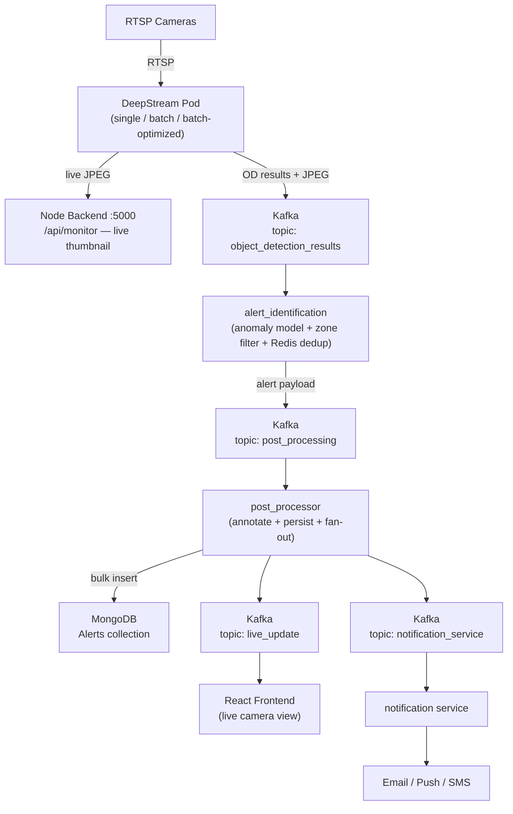

# 🚀 Aksha v2.1 — DeepStream Pipeline Architectures

This document describes the three DeepStream inference pipeline variants available in Aksha v2.1, their internal architectures, the downstream alert processing pipeline they feed, and guidance on when to use each variant.

---

## 1️⃣ Overview

All three variants replace the original two-container setup (`frame_reader` + `object_detection_service_gpu`) with an integrated GStreamer + NVIDIA inference pipeline. Every variant produces the same Kafka output format (`object_detection_results`) so the downstream `alert_identification → post_processor → notification` pipeline needs no changes regardless of which variant is active.

| Variant                       | Container per Camera | Inference Engine         | GPU Memory Sharing | Best For              |
| ----------------------------- | -------------------- | ------------------------ | ------------------ | --------------------- |
| **DeepStream Single**         | 1 per camera         | ONNX Runtime (TRT/CUDA)  | None               | 1–3 cameras, isolation |
| **DeepStream Batch**          | 1 per N cameras      | ONNX Runtime (TRT/CUDA)  | BatchWorker shared | 50 cameras           |
| **DeepStream Batch Optimized**| 1 per N cameras      | Native `nvinfer` (TRT)   | nvstreammux shared | 50-70 cameras, max throughput |

---

## 2️⃣ Overall Data Flow — DeepStream → Alerts → Notification

### 🧠 End-to-End Pipeline

```
  ┌─────────────────────────────────────────────────────────────────────────────┐
  │  DeepStream Pod  (any variant — single / batch / batch-optimized)            │
  │                                                                               │
  │  RTSP Cameras → GStreamer → Prefilter → YOLOv10 / nvinfer TRT              │
  │    → KafkaProducer  →  topic: object_detection_results                      │
  │    → _LivePublisher → POST /api/monitor/ (live thumbnail → Node backend)   │
  └──────────────────────────────────┬──────────────────────────────────────────┘
                                     │  JSON: JPEG (base64) + OD results
                                     ▼
  ┌──────────────────────────────────────────────────────────────────────────────┐
  │  alert_identification                                                         │
  │                                                                               │
  │  Consumes: object_detection_results                                           │
  │  Applies: anomaly model, crowd threshold, zone filters, Redis dedup          │
  │  Produces: topic: post_processing  (alerts + non-alerts)                    │
  └──────────────────────────────────┬──────────────────────────────────────────┘
                                     │  JSON: JPEG + alert metadata
                                     ▼
  ┌──────────────────────────────────────────────────────────────────────────────┐
  │  post_processor                                                                │
  │                                                                               │
  │  Consumes: post_processing                                                    │
  │  Annotates JPEG frame (OpenCV — bounding boxes, labels)                      │
  │  Writes: MongoDB Alerts collection  (bulk, MONGO_BATCH_SIZE=10)             │
  │  Produces: topic: live_update          → frontend live view                  │
  │            topic: notification_service → alert dispatch                      │
  └─────────────────┬──────────────────────────┬───────────────────────────────┘
                    │                           │
                    ▼                           ▼
           [ MongoDB ]              ┌───────────────────────┐
         (Alerts, frames,           │  notification service  │
          camera config)            │                        │
                                    │  Email / Push / SMS   │
                                    └───────────────────────┘
```

### 🌐 Mermaid Diagram



### 📋 Stage Summary

| Stage | Service                  | Kafka In                    | Kafka Out                                        | Storage         |
| ----- | ------------------------ | --------------------------- | ------------------------------------------------ | --------------- |
| 1     | **DeepStream Pod**       | —                           | `object_detection_results`                       | Disk (JPEG thumbnails) |
| 2     | **alert_identification** | `object_detection_results`  | `post_processing`                                | Redis (state)   |
| 3     | **post_processor**       | `post_processing`           | `live_update`, `notification_service`            | MongoDB         |
| 4     | **notification**         | `notification_service`      | —                                                | —               |

---

## 3️⃣ DeepStream Single — One Container per Camera

**Use when**: 1–3 cameras, maximum isolation per stream, or GPU memory is not a constraint.

### Architecture

```
  ┌──────────────────────────────────────────────────────────────────────────────┐
  │  GStreamer Pipeline  (one process per camera)                                 │
  │                                                                               │
  │  RTSP stream  (TCP, latency 200 ms)                                          │
  │    → nvv4l2decoder      (NVDEC — hardware H.264 / H.265 decode, ~0% CPU)    │
  │    → nvvideoconvert     (GPU resize + NV12, stays in NVMM memory)           │
  │    → nvvideoconvert     (NVMM → system memory, RGBx format)                │
  │    → appsink            (rate-limited to target FPS, 1 s pull timeout)      │
  └─────────────────────────────────┬────────────────────────────────────────────┘
                                    │  RGBx numpy array
  ┌─────────────────────────────────▼────────────────────────────────────────────┐
  │  Processing Loop                                                               │
  │                                                                               │
  │  Prefilter  (picks fastest available path)                                   │
  │    cv2.cuda absdiff → mean pixel diff   (GPU, FAST_PREFILTER=true)          │
  │    numpy   absdiff → mean pixel diff    (CPU fallback)                       │
  │    SSIM structural similarity           (FAST_PREFILTER=false)              │
  │    → below threshold: write thumbnail only, skip OD                          │
  │                                                                               │
  │  YOLOv10 ONNX Inference                                                      │
  │    Provider priority: TRT FP16 → CUDA → CPU                                  │
  │    → object_detection() → get_labels() (second NMS pass)                    │
  │                                                                               │
  │  KafkaProducer   →  topic: object_detection_results                          │
  │    payload: {frame_id, frame_bytes (JPEG / base64), OD results}             │
  │  _LivePublisher  →  workday.jpg / holiday.jpg  →  POST /api/monitor/        │
  └──────────────────────────────────────────────────────────────────────────────┘
```

### Key Properties

| Property              | Value                                              |
| --------------------- | -------------------------------------------------- |
| Containers per camera | **1**                                              |
| Decode                | NVDEC (nvv4l2decoder)                              |
| Inference             | YOLOv10 ONNX — TRT FP16 → CUDA → CPU provider     |
| Prefilter             | cv2.cuda absdiff (GPU) or numpy (CPU) or SSIM      |
| Output topic          | `object_detection_results`                         |
| No FastAPI endpoint   | Stateless — no `/reload`, no `/health`             |
| CPU saving vs old     | **18–25%** (no raw_frame Kafka hop, NVDEC decode)  |

### CPU Savings Breakdown vs Old Two-Container Setup

```
  NVDEC hardware decode           saves ~10–15%  (was cv2.VideoCapture software decode)
  No raw_frame Kafka hop          saves  ~5%     (no encode → publish → consume cycle)
  No base64 round-trip            saves  ~3%
  One container instead of two    no inter-process network overhead
  ─────────────────────────────────────────────────────────────────
  Total expected                       18–25% CPU reduction system-wide
```

---

## 4️⃣ DeepStream Batch — Shared BatchWorker across N Cameras

**Use when**: 4–15 cameras sharing one GPU, balancing isolation vs. throughput.

### Architecture

```
  ┌─────────────────────────────────────────────────────────────────────────────┐
  │  CameraSession × N  (one GStreamer thread per camera)                        │
  │                                                                               │
  │  RTSP stream                                                                  │
  │    → rtspsrc          (TCP, latency 200 ms)                                  │
  │    → nvv4l2decoder    (NVDEC — hardware H.264 / H.265 decode)               │
  │    → nvvideoconvert   (scale to target resolution, NV12 → RGBA)             │
  │    → appsink          (rate-limited to target FPS)                           │
  │                                                                               │
  │  GPUPrefilter  (picks fastest available path)                               │
  │    cv2.cuda absdiff  →  mean pixel diff   (GPU, no download)                │
  │    numpy   absdiff   →  mean pixel diff   (CPU fallback)                    │
  │    SSIM              →  structural similarity  (FAST_PREFILTER=false)       │
  │    → threshold exceeded: push to frame_queue                                 │
  │                                                                               │
  │  AdaptiveSkip                                                                 │
  │    burst  (streak ≤ N frames)   →  run OD every frame                       │
  │    sustained motion             →  run OD every Kth frame                   │
  │                                                                               │
  │    → frame_queue  (maxsize=2, drops stale frames on full)                   │
  └─────────────────────────┬───────────────────────────────────────────────────┘
                             │  N queues  (one per active camera)
  ┌──────────────────────────▼──────────────────────────────────────────────────┐
  │  BatchWorker  (single shared thread)                                          │
  │                                                                               │
  │  Collect one frame per camera within BATCH_TIMEOUT_MS                        │
  │    → batch_object_detection  [N, 3, 640, 640]                                │
  │         Provider priority: TRT FP16 → CUDA → CPU                            │
  │    → JPEG encode                                                              │
  │         nvjpeg (GPU, Turing/Ampere+) → turbojpeg (CPU) → cv2 fallback      │
  │    → KafkaProducer  linger=50 ms, gzip compression                           │
  │         topic: object_detection_results  (OD results + JPEG frame)           │
  │         topic: raw_frame                 (PUBLISH_RAW_FRAME=true only)       │
  │    → Write live thumbnails  +  POST /api/monitor/  (node_backend)           │
  └─────────────────────────────────────────────────────────────────────────────┘

  FastAPI  (port 8080)
    POST /reload   — re-read rtsplinks.json, reconcile active camera sessions
    GET  /health   — liveness probe
    GET  /cameras  — active camera list with RTSP URL + FPS
```

### Controller Integration

```
  Controller  (deployment_mode="deepstream_batch")
    → writes rtsplinks.json with batch_id per camera
    → POST /reload  triggers CameraSession add / remove / restart
    Per-camera config (fps, resolution, ssim_thresh, codec) fetched from MongoDB
```

### Key Properties

| Property              | Value                                                           |
| --------------------- | --------------------------------------------------------------- |
| Containers per N cams | **1** (one pod handles N cameras; `BATCH_COUNT` pods total)     |
| Decode                | NVDEC (nvv4l2decoder) per camera                               |
| Inference             | ONNX Runtime batch — TRT FP16 → CUDA → CPU                     |
| Prefilter             | GPUPrefilter (cv2.cuda / numpy / SSIM)                         |
| Motion adaptation     | AdaptiveSkip — burst vs. sustained throttle                     |
| Frame queue           | maxsize=2, drops stale on full                                 |
| JPEG encode           | nvjpeg → turbojpeg → cv2                                       |
| Output topics         | `object_detection_results` (always), `raw_frame` (optional)    |
| API                   | FastAPI port 8080: `/reload`, `/health`, `/cameras`            |

---

## 5️⃣ DeepStream Batch Optimized — Native nvinfer + Pull Workers

**Use when**: 10–50 cameras, maximum GPU throughput, native TensorRT integration via DeepStream's `nvinfer` element.

### Architecture

```
  Per-Camera GStreamer Pipeline  (one per camera, all in one shared process)

  nvurisrcbin  →  tee
    │
    ├─ Branch A (inference):
    │     queue(leaky=downstream, max=1)
    │       → nvstreammux          (batch frames from all cameras)
    │       → nvinfer  (TRT FP16)  (native DeepStream inference plugin)
    │       → fakesink
    │          ↑ probe callback: reads tensor metadata → _latest_detections dict
    │
    └─ Branch B (frame grab):
          queue(leaky=downstream, max=1)
            → nvvideoconvert (RGBA, target w×h)
            → appsink_i
               ↑ N pull workers  (try-pull-sample, 10 ms timeout each)
                 → motion gate  (AdaptiveSkip — burst vs. sustained)
                 → JPEG encode  (nvjpeg → turbojpeg → cv2)
                 → merge _latest_detections from Branch A
                 → KafkaProducer  →  topic: object_detection_results
                 → _LivePublisher → POST /api/monitor/
```

### Key Difference vs DeepStream Batch

| Aspect                | DeepStream Batch              | DeepStream Batch Optimized              |
| --------------------- | ----------------------------- | --------------------------------------- |
| Inference element     | ONNX Runtime (via Python ORT) | Native `nvinfer` (TRT, via `pyds` probe)|
| Frame grab            | Single `BatchWorker` thread   | N pull-worker threads (one per camera)  |
| Detection read        | OD function returns results   | Probe reads tensor metadata from buffer |
| Pipeline topology     | Separate decode + batch queue | Tee — Branch A (infer) + Branch B (grab)|
| muxer                 | N/A                           | `nvstreammux` (feeds nvinfer)           |
| DeepStream bindings   | Not required                  | `pyds` required                         |
| JPEG encode           | nvjpeg → turbojpeg → cv2      | nvjpeg → turbojpeg → cv2               |
| Fault handling        | Standard                      | `faulthandler` enabled at startup       |

### Key Properties

| Property              | Value                                                             |
| --------------------- | ----------------------------------------------------------------- |
| Containers per N cams | **1** (`BATCH_ID` assigned per pod; controller manages mapping)  |
| Decode                | NVDEC (nvurisrcbin)                                              |
| Inference             | `nvinfer` plugin (TRT FP16) — native DeepStream element          |
| Frame grab            | Parallel appsink pull workers (`N_PULL_THREADS` env var)        |
| Motion gate           | AdaptiveSkip on pull side                                        |
| Detection source      | GStreamer buffer probe (tensor metadata via `pyds`)              |
| JPEG encode           | nvjpeg (GPU) → turbojpeg → cv2 fallback                         |
| Output topic          | `object_detection_results`                                        |
| API                   | FastAPI: `/reload`, `/health`                                    |
| Polling fallback      | Auto-reload every 30 s if camera set / config changes in MongoDB|

---

## 6️⃣ DeepStream Variants — Side-by-Side Comparison

```
                        Single          Batch           Batch Optimized
                        ──────────────────────────────────────────────
  Cameras per pod       1               N (4–15)        N (10–50)
  Decode                nvv4l2decoder   nvv4l2decoder   nvurisrcbin
  Inference engine      ONNX Runtime    ONNX Runtime    nvinfer (TRT native)
  Batching              None            BatchWorker     nvstreammux
  Frame grab            appsink         appsink/queue   appsink_i (pull workers)
  Prefilter             absdiff / SSIM  GPUPrefilter    motion gate (pull side)
  AdaptiveSkip          No              Yes             Yes
  FastAPI endpoint      No              Yes (8080)      Yes (8080)
  pyds required         No              No              Yes
  GPU memory sharing    Per-camera      BatchWorker     nvstreammux + pull workers
  Output topic          object_detection_results (same across all variants)
  Downstream services   alert_identification → post_processor → notification (unchanged)
```

---

## 7️⃣ Downstream Pipeline — alert_identification → post_processor → notification

### 7a. alert_identification

Consumes `object_detection_results`. Applies per-camera anomaly models loaded from MongoDB, crowd thresholds, zone polygon filters, and Redis-backed deduplication. Produces to `post_processing`.

```
  Kafka: object_detection_results
      │
      ▼
  alert_identification
      │  anomaly model (per-camera, loaded from MongoDB)
      │  zone / polygon filter
      │  crowd threshold  (env: CROWD_THRESHOLD, default 6)
      │  Redis dedup      (per-camera alert cooldown state — survives restarts)
      ▼
  Kafka: post_processing
```

### 7b. post_processor

Consumes `post_processing`. CPU-bound work (frame decode, OpenCV annotation, MongoDB / Redis I/O) is offloaded to a `ThreadPoolExecutor` so the async event loop is never blocked. A daemon thread handles live-image HTTP POSTs.

```
  Kafka: post_processing
      │  asyncio consumer  (BATCH_SIZE=10, COMMIT_INTERVAL=10)
      │  ThreadPoolExecutor: decode, annotate, MongoDB insert, Redis read
      │
      ├──► annotate JPEG frame  (OpenCV: bounding boxes, labels, metadata)
      │
      ├──► MongoDB  Alerts collection
      │      bulk insert  MONGO_BATCH_SIZE=10
      │      raw frame saved to disk  (throttled 1 / 30 s per camera)
      │                               (always saved on alert)
      │
      ├──► Kafka: live_update          →  annotated JPEG → React frontend live view
      └──► Kafka: notification_service →  alert payload  → notification service

  Stale frame drop thresholds:
    Non-alert frames older than  15 s  are dropped without processing
    Alert frames older than      60 s  are dropped
```

### 7c. notification

Consumes `notification_service`. Applies cooldown / dedup via `NotificationService`. Dispatches to email, push, or webhook targets.

```
  Kafka: notification_service
      │
      ▼
  notification service
      │  cooldown / dedup filter
      ├──► Email API
      ├──► Push notification
      └──► Webhook
```

---

## 8️⃣ Kafka Topics Reference

| Topic                       | Producer                  | Consumer                       | Payload                                     |
| --------------------------- | ------------------------- | ------------------------------ | ------------------------------------------- |
| `object_detection_results`  | DeepStream pods           | alert_identification           | JPEG (base64) + OD bounding boxes           |
| `raw_frame`                 | DeepStream Batch (opt.)   | anomaly pipeline               | Raw JPEG frame (no OD overlay)              |
| `post_processing`           | alert_identification      | post_processor                 | JPEG + alert metadata + anomaly flags       |
| `live_update`               | post_processor            | React frontend (via Node)      | Annotated JPEG for live camera view         |
| `notification_service`      | post_processor            | notification service           | Alert payload (camera, time, type, frame)   |

---

## 9️⃣ Deployment Mode — Controller Configuration

The controller service selects the active pipeline via `deployment_mode` in the camera config:

```python
# Supported values in camera Item model:
deployment_mode = "frame_reader"        # CPU-only: frame_reader + object_detection_service
deployment_mode = "deepstream_single"   # 1 container per camera (GPU)
deployment_mode = "deepstream_batch"    # N cameras per pod (GPU, BatchWorker)
# deepstream_batch_optimized is deployed as a separate compose service with BATCH_ID
```

```
  Controller POST /Surveillance
      │
      ├─ deployment_mode="frame_reader"
      │     → start frame_reader container per camera
      │
      ├─ deployment_mode="deepstream_single"
      │     → start deepstream_service container per camera
      │
      └─ deployment_mode="deepstream_batch"
            → write rtsplinks.json  (batch_id per camera)
            → POST /reload  to deepstream-batch pod(s)
            → CameraSession add / remove / restart
```

---

## 🔟 Troubleshooting

| Symptom                                    | Likely Cause                                              | Fix                                                                 |
| ------------------------------------------ | --------------------------------------------------------- | ------------------------------------------------------------------- |
| `ERR_EMPTY_RESPONSE` on insight endpoint   | 30 s write deadline fires before 60 s heatmap completes  | Insight route registered before Timeout middleware (fixed in Go backend) |
| DeepStream pod exits immediately           | GPU not available / NVDEC driver missing                  | Check `nvidia-smi`; ensure `--gpus all` in Docker run              |
| `nvinfer` probe returns no detections      | TRT engine not built / wrong batch size                   | Delete TRT cache, restart pod to rebuild; set `BATCH_TIMEOUT_MS`   |
| Kafka lag growing on `post_processing`     | post_processor overloaded                                 | Increase replicas; tune `BATCH_SIZE` and `COMMIT_INTERVAL`          |
| Cameras missing from batch pod             | `batch_id` mismatch in rtsplinks.json                    | POST `/reload` to correct pod; check `BATCH_COUNT` env var          |
| Stale thumbnails on live view              | `_LivePublisher` queue backed up                          | Check node_backend connectivity; `POST /api/monitor/` latency       |
| Annotations missing on alerts in UI        | post_processor dropped frame as stale                     | Check frame timestamp vs stale thresholds (15 s / 60 s)             |
| `pyds` import error in batch optimized     | DeepStream Python bindings not installed                  | Rebuild image from NVIDIA DeepStream base; check `pyds` wheel       |
